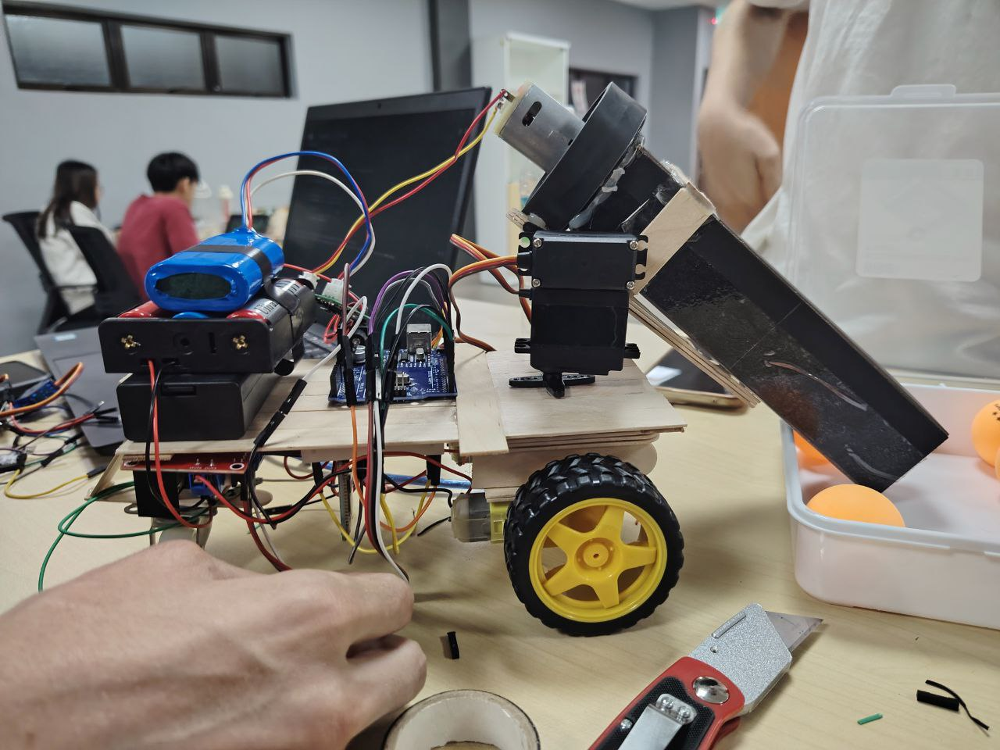
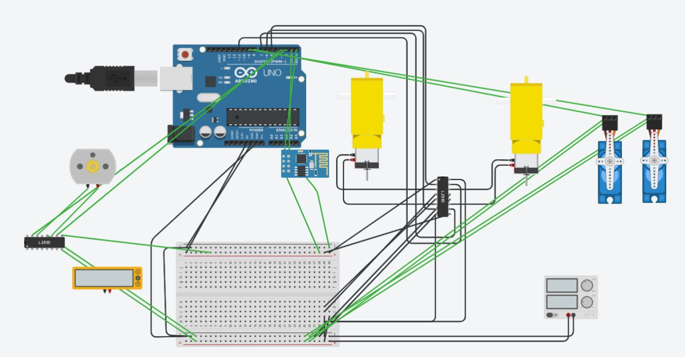

# Suction Car Project 🚗🧲

An Arduino-powered Bluetooth-controlled suction vehicle built as part of our Mechatronics course + competition.  
Yes, it failed the qualification test. Yes, we fixed it within a day after the competition. 😅

---

## 🔧 Features
- Bluetooth control (via Play Store mobile app)
- Mode switch: Car Mode ↔ Suction Mode
- Dual-axis servo-controlled arm (Up/Down + Left/Right)
- Suction mechanism using motor-generated pressure differential
- Built-in LED to indicate current mode
- Full recovery after hardware failure on competition day ⚠️

---

## 📷 Demo Photos
- 
- 
- 
---

## 📁 Included Files
| File/Folder | Description |
|-------------|-------------|
| `suction_car.ino` | Full Arduino code |
| `images & Docs` | Photos and circuit diagram |
| `README.md` | Project overview |

---

## 🛠️ Tech Stack
- Arduino Uno
- L298N Motor Driver
- DC Motor (for suction)
- Servo Motors (2 DOF)
- Bluetooth HC-05 Module
- Serial command-based control system

---

## 🧠 Arduino Code
Full source code available in [`code/SuctionCar.ino`](code/SuctionCar.ino)

---

## 👨‍💻 Developed by
**Lawrance Sim**  
Mechanical Engineering @ Universiti Teknologi Malaysia  
Code & debugging fully handled by me ✌️

---

> _"It died during the competition. But was revived the very next day. That's engineering spirit."_ ⚙️
